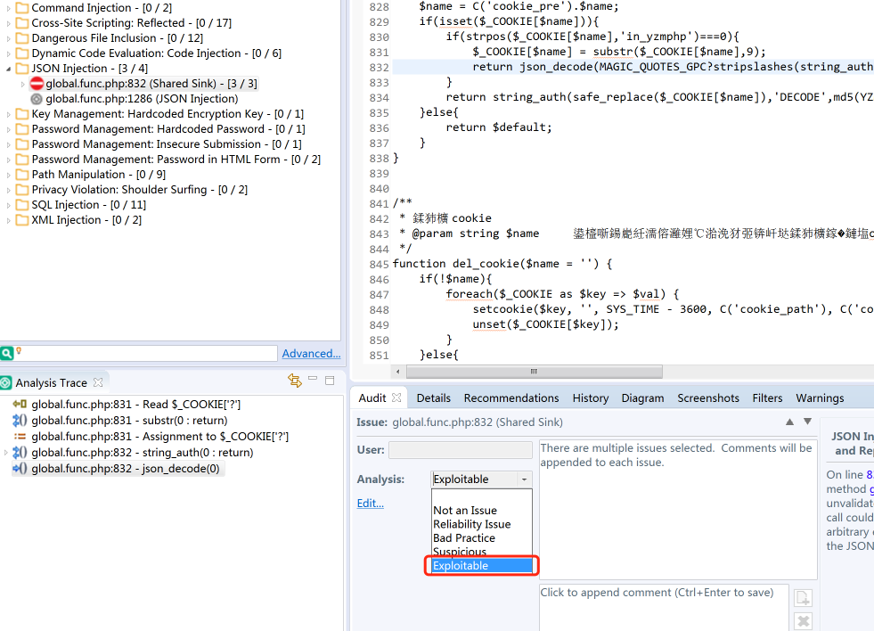
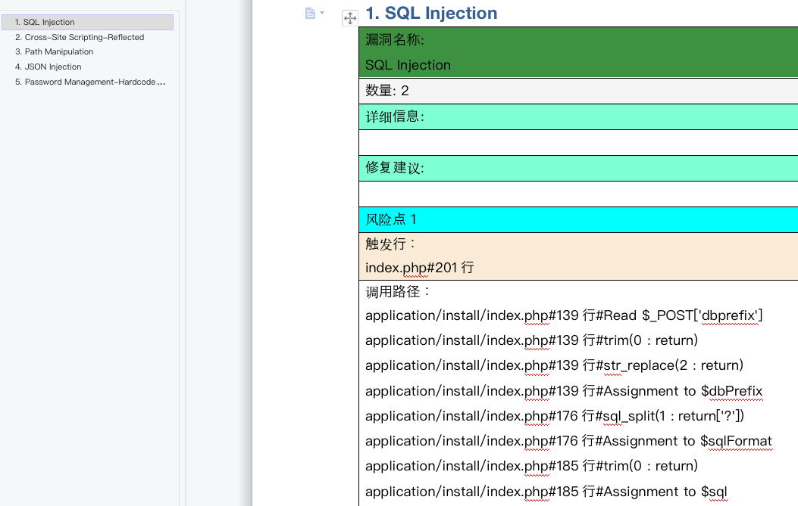

# Fortify_tool


## 0x01 简介

从fortify的项目文件中提取审计过漏洞的详细调用流程，并导出保存到word中


## 0x02 使用

**命令**

```
python3 fortify_tool.py -p vuln.fpr
```


**操作**

1、对fortify扫描结果进行审计，标记为Exploitable




2、另存项目为fpr文件提取审计过漏洞的详细信息导出报告

```
python3 fortify_tool.py -p vuln.fpr
```




## 0x03 脚本更新

**2022-10-29**

漏洞覆盖大部分情况，小部分丢失漏洞标题的问题碰到了再改